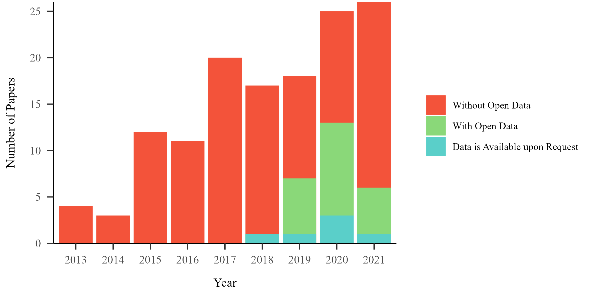

 Open data is a growing trend among academic journals. Authors can either posit their data on an open repository or leave a statement “Data is available upon (reasonable) request”.  Recently, a few papers checked whether "Data is available upon request". A recent preprint in social psychology, among other published studies, depicted a quit bleak picture that "Data is not available upon request" (Gabelica et al., 2022; Hussey, 2023; Tedersoo et al., 2021).
To add some anecdote data to the topic about “Data available upon request” statement, we also share our experience in request data here.

## Background 
I am involved in two ongoing and interconnected projects. The first project focuses on conducting a meta-analysis of articles that have employed the Self-perceptual matching task (SPMT) paradigm. The second project aims to assess the reliability of the SPMT paradigm by reanalyzing research data in published studies. To strengthen the persuasiveness of our findings, the second project requires us to search for publicly available data within the database established from the first project (see our preregistration: https://osf.io/zv628).

## More datasets are available after 2018
Our meta-analysis database covers a total of 136 articles citing Sui et al. (2012) from 2013 to 2021 (it should be noted that articles from 2021 may not be included in the database). Among these 136 articles, only 27 claim to have publicly available data. Within these 27 articles, 21 directly provide original data through links in their papers. However, out of these 21 articles, one of them includes an OSF address in their paper, yet it does not contain any data. Furthermore, the remaining 6 articles mention that "Data is available upon request."

Figure 1. Number of Paper with or without open data

## More open data than “upon request”
In our reliability project, we selected articles that are only slightly deviated from the original paradigm. That said, we need to get access to data from 14 articles (see our preregistration for details).
Among these articles, 9 of them provided links in papers. One of the nine links was empty. We reached out to authors via email, so far, no changes on OSF page.
The remaining 5 articles stated that "Data is available upon request".

 

Figure 2. Data is already public or upon request

## 60% of data are available upon request
For those 5 papers, we sent emails and received responses from each author. Among them, three authors (60%) directly provided trial-level data, allowing us to use this data for our purpose. Additionally, two authors provided average values of participants under different experimental conditions. 
In a sense, all the articles claiming 'Data is available upon request' have provided us with data, though not all data are useful for our purpose.
 
 

Figure 3. Feedback Data After Request

Overall, the process of requesting data from original authors was relatively smooth, with the majority of authors responding promptly and being willing to share their data. Although two authors provided only individuals’ summary data due to various reasons, these data might be of use for meta-analysis. 
In our experience, most of authors have a positive attitude towards data sharing and are willing to respond to our requests. However, not all trial-level data are available, as some authors may encounter technical issues or lack of time. 
As an early career researcher who request data for the first time, I have learned three lessons. (1), write the emails well. I refer the article published in Science (Gruber et al., 2020) on how to write emails. (2), provide as much information about why you need the data as possible. In our case, our protocol and code are already open on GitHub (https://github.com/Chuan-Peng-Lab/ReliabilitySPE), and we included it in all our emails. (3), update the authors’ email through searching. As mentioned by Hussey (2023) in their article, the email addresses provided in many papers may be incorrect and unable to reach the authors. We searched for authors’ information on Google Scholar and found their latest publications and obtain their currently used email address. 

## Reference

- Gabelica, M., et al. (2022). Many researchers were not compliant with their published data sharing statement: a mixed-methods study. Journal of Clinical Epidemiology, 150, 33-41. https://doi.org/10.1016/j.jclinepi.2022.05.019 

- Gruber, J., et al. (2020). A scientist's guide to email etiquette. Science. https://doi.org/10.1126/science.caredit.abb2664 

- Hussey, I. (2023). Data is not available upon request. https://psyarxiv.com/jbu9r/ 

- Sui, J., et al. (2012). Perceptual effects of social salience: Evidence from self-prioritization effects on perceptual matching. Journal of experimental psychology. Human perception and performance, 38(5), 1105-1117. https://doi.org/10.1037/a0029792 

- Tedersoo, L., et al. (2021). Data sharing practices and data availability upon request differ across scientific disciplines. Scientific data, 8(1), 192. https://doi.org/10.1038/s41597-021-00981-0 

--
-------------------------------------------------------------------------------------------------

Graduate Student, Hu Mengzhen

School of Psychology, Nanjing Normal University, 210024 Nanjing, China.

Email: hmz1969a@gmail.com

-------------------------------------------------------------------------------------------------