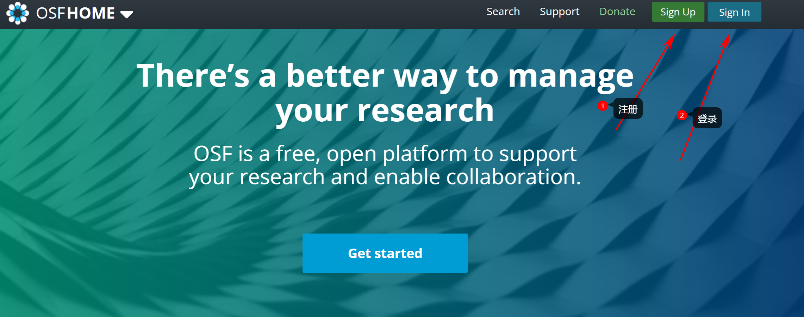
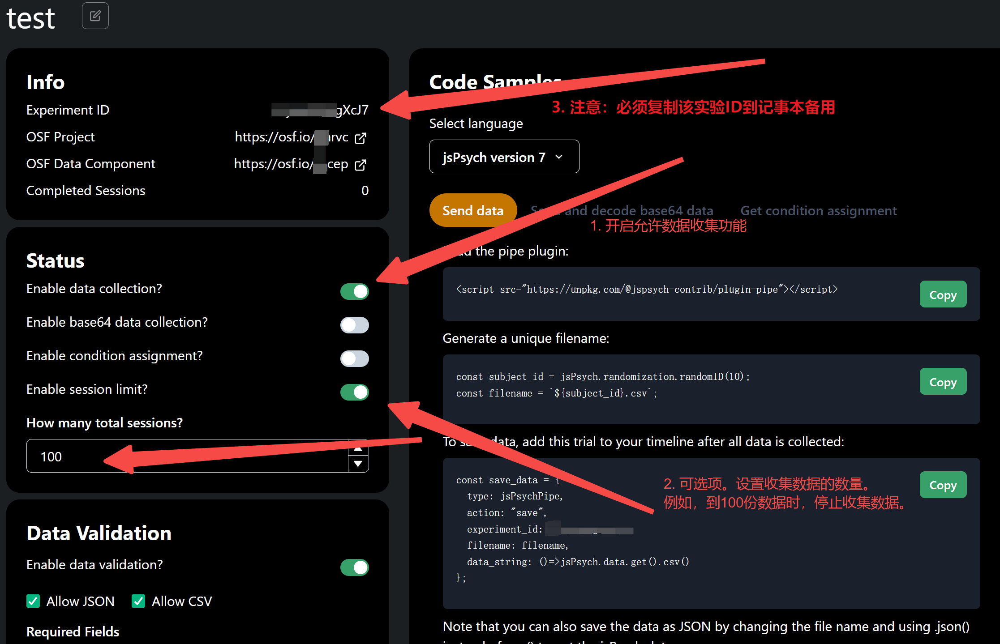

# DataPipe：如何免费保存+备份实验数据

你是否因为电脑损害而弄丢过实验数据？明明是线上实验，但数据却不能上传云端？或者你也是OpenScience的拥趸(检索该公众号试试)，想把自己的实验数据放到开放平台 OSF，做出自己的贡献?

没错，就在今天，这一切可以轻松的完成。今天我要隆重的给大家介绍一个非常好用的数据收集工具——DataPipe。

- DataPipe 是一个开放平台，提供REST API接口，可以让你在任何实验程序上把实验数据上传到OSF(Open Science Framework)。

    - 如果你不知什么是 REST API。没关系，你就当他是一个网站，当你访问他，你就可以上传数据，只不过这一切可以用一行简单的代码实现。

    - 如果你不知道 OSF。没关系，你就当他是 github 或者一个云盘，可以用来存储你的代码和实验数据等。

- DataPipe 已经集成到实验编程工具 [jsPsych](https://www.jspsych.org/7.3/) 当中，你可以很方便的在 jsPsych 调用 DataPipe 的API。

    - 如果你不了解 jsPsych，可以理解为他是类似于 E-prime, psychtoolbox(Matlab), psychopy(Python), OpenSesame的实验编程工具。

    - 此外，它可以方便的用于在线实验，或在线问卷数据的收集。类似于 Qualtrics, Credamo等。

    - 你可以点击连接 [jsPsych](https://www.jspsych.org/7.3/)  进行了解。它使用前端代码 html + js 来实现实验程序的编程。

让我们回到正题，今天我将以 jspsych 和 psychopy 为例，演示如何使用DataPipe来收集数据，并把数据上传到 osf中。

后面涉及到的测试材料在这里 [https://gitee.com/epool/data-pipe_primer](https://gitee.com/epool/data-pipe_primer) 大家可以自行体验和设置。

## 前提准备

在 jspsych 和 psychopy 进行加入 DataPipe 功能前，你需要做如下配置：注册 osf 账号，在 osf 中创建项目；在 DataPipe 中创建项目，连接 osf 的项目，进行一些基本配置。跟着我的步伐，5分钟完成配置。

### 创建OSF项目

如果你还没有 osf 账号，请 [https://osf.io/](https://osf.io/) 登陆官网进行简单的注册。

然后，为了给 DataPipe 的访问权限，我们需要生成**密钥(token)**。

最后，在OSF主页点击“Create Project”就可以创建项目了。注意，你需要复制**项目的编号**，在下图中。

## 在DataPipe上创建实验

完成 OSF 的配置后，我们需要对 DataPipe进行配置。

首先，进入 [https://pipe.jspsych.org/](https://pipe.jspsych.org/)。 进行注册和登陆。

之后，将之前 osf 的密钥(token)配置到 DataPipe 中。

最后，创建项目（实验），Done。

这样你就进入了这个实验的控制面板,可以设置一些实验参数了。有些功能我们暂时用不到，就先不介绍了。

注意，请一定要复制实验ID备用。

## 在实验中集成DataPipe

为了能够将数据发送到DataPipe,你需要在实验代码中调用DataPipe的API。如果你在使用jsPsych来编写实验,可以直接使用jsPsychPipe插件调用DataPipe。如果不使用jsPsych,也可以直接通过fetch API调用DataPipe。

在DataPipe的实验页面,已经提供了不同语言调用DataPipe API的代码示例。选择适合你的语言,根据页面上的指引就可以轻松地在实验中集成DataPipe了。

### 在 jspsych 中进行设置

具体代码见 [jspsych_exp_test.html](http://epool.gitee.io/data-pipe_primer/jspsych_exp_test.html)。 大家可以下载该模板自行进行更改。

这里指针对关键代码进行解释。

- `filename` 为上传的文件名称。

- `experiment_id` 为 DataPipe 配置中的 ID。这个非常关键，确保填写正确。

大家可以进入 [http://epool.gitee.io/data-pipe_primer/jspsych_exp_test.html](http://epool.gitee.io/data-pipe_primer/jspsych_exp_test.html) 进行测试。在本地运行也是相同的，点击下一页就会上传数据。

上传的数据如下，名称为之前设置的 `filename`

### 在 psychopy 中进行设置

打开psychopy，我们以自带的 stroop 实验为例。(注意，我是用的psychopy版本为 2023.2.2)

然后，添加 code 模块。并进行相应的设置，也就是最关键的，实验ID，文件名和数据。

- 在 python 中可以通过 `thisExp.getJSON()` 获取数据。 这里将数据保存为 json，你也可以自行转化为 csv。**注意，在我自己的测试中，python 代码会遇到 SSL 错误。所以我使用 js 的实现方式，见下方。**

- 在 js code 中，可以通过 `psychoJS.experiment.getJSON();`获取数据。注意：js code 需要将实验全部转化为 js + html 后再游览器里运行。

最后，运行实验 (注意，我运行的 html 的实验程序而不是 python 代码)就可以上传数据了。

## 额外阅读：发布实验

把编写好的实验文件发布到网上,以便参与者可以访问。发布实验的方式很多,但我这里推荐使用GitHub Pages 或者 Gitee Pages (就像我提供的那个仓库一样),因为它完全免费,使用非常方便。

- 首先,在GitHub上创建一个新的仓库。在仓库的设置页面,打开GitHub Pages功能,选择从main分支部署。这样就可以通过`https://[your username].github.io/[your repository name]`来访问你的实验页面了。最后,将你的实验文件上传到仓库中,这样参与者就可以访问了。

- 如果你的HTML文件不是index.html,那么需要在URL后面加上HTML文件名,比如`https://[your username].github.io/[your repository name]/experiment.html`。

如果使用的是 psychopy 也可以通过 pavlovia.org 来进行线上实验的部署。

## 额外阅读：配置实验

在控制面板上,你可以启用DataPipe的一些高级功能:

- 条件分配:可以向DataPipe请求下一个条件编号,用于在多条件实验中指派参与者到不同的条件中。

- 数据验证:在将数据发往OSF之前,先检查数据的格式是否正确。这可以避免误传或恶意传输错误数据。

- 会话上限:限制每次实验收集的数据条数上限,也是为了避免误传或恶意传输大量无效数据。

建议根据实验需要谨慎启用这些功能。

> 参考资料 source: 
> * [https://pipe.jspsych.org/homepipe.png](https://pipe.jspsych.org/homepipe.png)
> * [pipe.jspsych.org](https://pipe.jspsych.org/)
> * De Leeuw, J. R. (2023). DataPipe: Born-open data collection for online experiments. *Behavior Research Methods*. [https://doi.org/10.3758/s13428-023-02161-x](https://doi.org/10.3758/s13428-023-02161-x)
