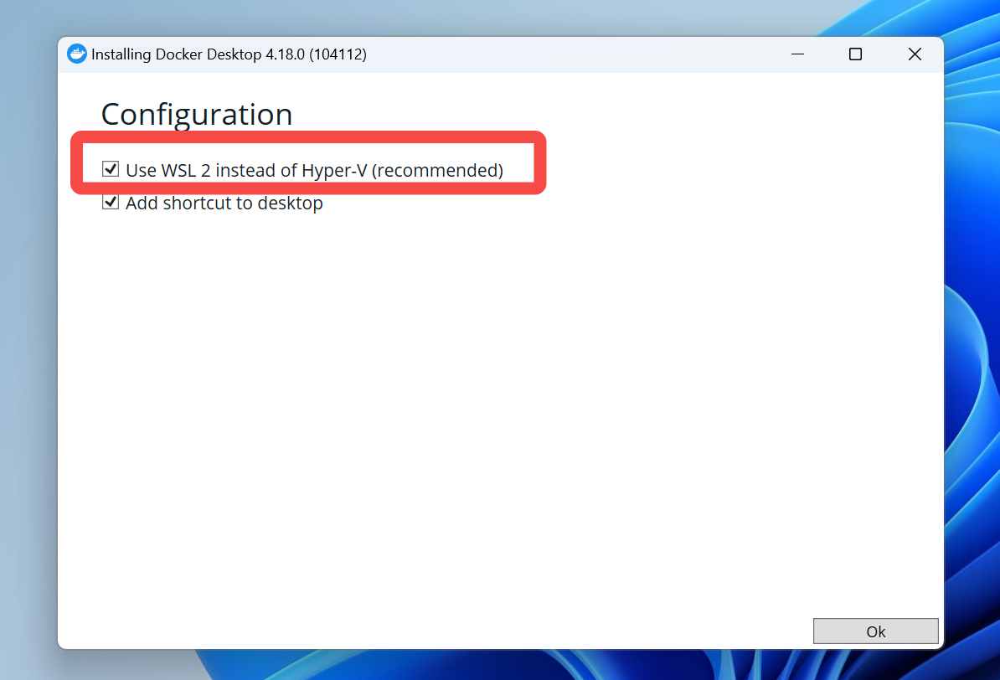
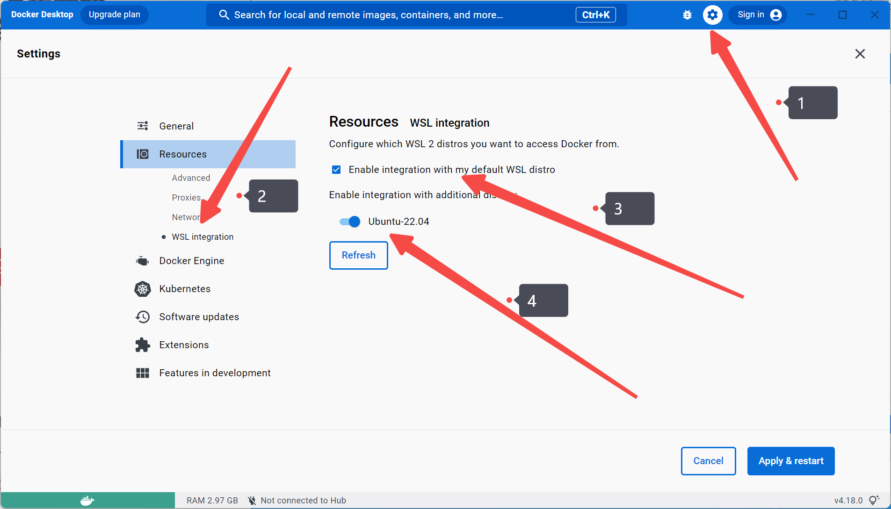
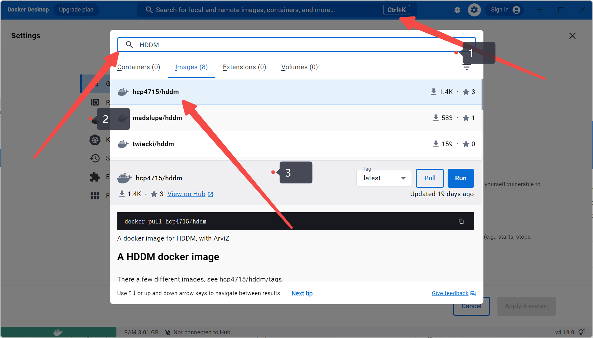
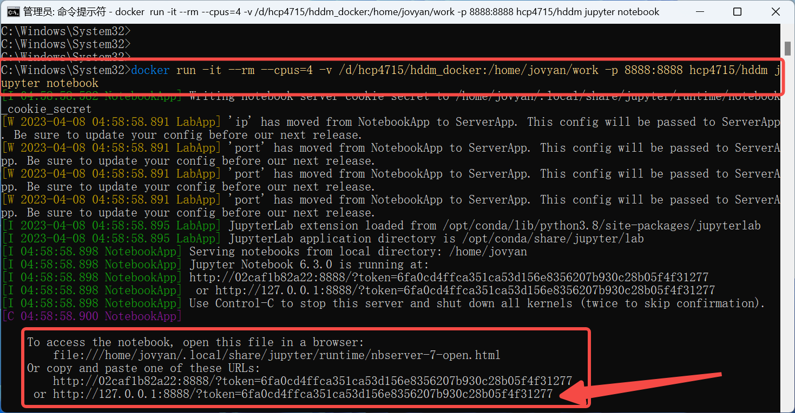

本文将介绍两种在 windows 平台下安装 HDDM(0.9.8) 的方法。
- 主要通过 wsl2 安装 docker 或者 linux 环境
- 然后再在 docker 或者 linux 环境下安装 HDDM

# 通过 docker 部署 HDDM
首先，安装 docker

下载 docker，有 600M
[Docker: Accelerated, Containerized Application Development](https://www.docker.com/)



注意：Windows 10 版本 2004 或更高版本才能使用 wsl2。 可以在命令行中使用 winver 查看版本号。
如果版本低于 2004，请不要勾选 wsl2，此时可以使用 Hyper-V 来运行 docker 环境。
如果不存在 wsl2，可以参考该安装方法 [官方文档](https://docs.microsoft.com/en-us/windows/wsl/install-win10)。


由于只能装 C 盘，所以直接点 "ok" 就开始安装了。
大概安装 2-3分钟

如果提醒 "log out"，就需要注销电脑，请注意。


注销或重启后，点击"接受"协议即可。


## docker 设置 + 安装 HDDM

在设置->安装后选择启用WSL2引擎


### 正式安装 HDDM

之后就可以在wsl命令行中使用docker了。
找到 HDDM docker

- 可直接点解 pull
- 也可以运行命令 `docker pull hcp4715/hddm -o /path/to/my/images`
- 其中，-o 可以设置储存的**相对位置**

### docker 启动 HDDM 镜像

```
# windows
docker run -it --rm --cpus=4 -v /d/hcp4715/hddm_docker:/home/jovyan/work -p 8888:8888 hcp4715/hddm jupyter notebook 

# Ubantu
docker run -it --rm --cpus=4 \
-v /home/hcp4715/hddm_docker:/home/jovyan/work \
-p 8888:8888 hcp4715/hddm:0.8 jupyter notebook
```



也可以通过界面操作启动 


新建一个 notebook


导入 hddm 进行测试


---

# 通过 Ubuntu-18.04 部署 HDDM

以 windows 系统下，使用 wsl2 + ubuntu 系统安装 hddm 为例。

首先确保系统已经安装 Windows Subsystem for Linux 2 (WSL2) ，具体安装方法可以参考 [官方文档](https://docs.microsoft.com/en-us/windows/wsl/install-win10)。

```bash
wsl --install -d Ubuntu-18.04
```

- 注意，此时可能需要设置linux系统账号和密码。
- 注意，输入密码时并不会显示，请输入完成后直接点击回车。

(可选)：由于 linux 子系统默认安装在 c 盘。因此，可以将起移动到其他磁盘中。

```bash
# 导出子系统
wsl --export Ubuntu-18.04 D:\\docker\\wsl-Ubuntu-18.04.tar
# 关闭子系统
wsl --shutdown
# 注销(删除)子系统
wsl --unregister Ubuntu-18.04
# 导入系统文件到其他磁盘
wsl --import Ubuntu-18.04 d:\\docker\\wsl2_ubuntu1804 d:\\docker\\wsl-Ubuntu-18.04.tar --version 2
# 注意，第一个路径为新的安装路径，第二路径为导出的系统文件，--version 2 表明了后端为 wsl2。

# 启动系统
wsl -d Ubuntu-18.04
```

## 安装依赖

由于 HDDM ，包括起依赖 pymc, ssms 需要进行编译。因此我们需要提前配置好环境，包括 GCC、Gfortran。

```bash
sudo apt-get update
sudo apt install gcc
sudo apt install gfortran
sudo apt install build-essential
```

## 安装 Miniconda

之后，我们需要安装 python 环境，最好的方式是通过 conda 进行 Python 环境的配置

```bash
# 下载 miniconda
wget https://repo.anaconda.com/miniconda/Miniconda3-latest-Linux-x86_64.sh
# 可自行去官网选择其他版本，比如 <https://repo.anaconda.com/miniconda/Miniconda3-py37_4.12.0-Linux-x86_64.sh>

# 设置权限
chmod +x Miniconda3-latest-Linux-x86_64.sh
# 安装 miniconda
./Miniconda3-latest-Linux-x86_64.sh
# 记得看完协议后 yes

# 进入 conda 环境
bash
```

这一段代码是安装 Miniconda，它是一个流行的 Python 包管理器和环境管理器。安装 Miniconda 后，我们可以使用它来安装 Python 和其他必要的包。

(可选)设置国内镜像：

```bash
# (可选)配置国内镜像
conda config --add channels https://mirrors.tuna.tsinghua.edu.cn/anaconda/pkgs/free/
conda config --set show_channel_urls yes
# 等同于打开 ~/.condarc文件   (sudo gedit ~/.condarc)
# 可以删除 - defaults 选项
```

## 创建并激活虚拟环境 + 安装 HDDM 和其它必要的包

最后，创建并激活名为 hddm 的虚拟环境。虚拟环境是一种将 Python 依赖项隔离开的机制，可以让我们在同一系统上管理多个 Python 环境。

```bash
conda create -n hddm python=3.9
conda activate hddm

```

安装 HDDM 相关包

```bash
pip install numpy==1.22.4 -i <https://pypi.tuna.tsinghua.edu.cn/simple>
pip install git+https://gitee.com/epool/pymc2.git
pip install git+https://gitee.com/epool/kabuki.git -i <https://pypi.tuna.tsinghua.edu.cn/simple>
pip install git+https://gitee.com/epool/ssm-simulators.git -i <https://pypi.tuna.tsinghua.edu.cn/simple>
pip install git+https://gitee.com/epool/hddm.git

```

## 测试 hddm 是否成功安装：

```python
import hddm

data, params = hddm.generate.gen_rand_data({'v':1, 'a':2, 't':.3}, size=100, subjs=5)
model = hddm.HDDM(data, include = ['v','a','t'])
model.sample(1000)
model.gen_stats()
```

---

(可选)： 安装 torch，以使用 hddm 中的 [LANs](https://elifesciences.org/articles/65074) 方法，即基于神经网络(neural network) + 贝叶斯近似(Approximate Bayesian Computation, ABC)的参数估计方法。

- 注意，安装前请 `nvcc --version`, `nvidia-smi` 查看CUDA版本和CUDA工具包的版本号，以正确下载对应项 pytorch 版本。
- 此外，最新的 pytorch 2.0 似乎不持支 HDDM。请使用更低的pytorch版本。

```python
pip install torch==1.11.0 torchvision==0.12.0 torchaudio==0.11.0 -i https://pypi.tuna.tsinghua.edu.cn/simple

# 安装 arviz 方便数据操作与绘图
pip install arviz -i https://pypi.tuna.tsinghua.edu.cn/simple

# 由于安装以上扩展包后，依赖会发生变化，建议重新安装 hddm 和 numpy等扩展包。
pip install git+https://gitee.com/epool/hddm.git
pip install numpy==1.22.4 -i https://pypi.tuna.tsinghua.edu.cn/simple
# pip install pymc ssms --no-cache-dir
```

测试 LANs 是否成功安装以及可以成功运行：

```python
conda activate hddm
import hddm

data, params = hddm.generate.gen_rand_data({'v':1, 'a':2, 't':.3}, size=100, subjs=5)
model = "ddm"
model = hddm.HDDMnn(data, model = model, include = ['v','a','t'])
model.sample(1000)
model.gen_stats()
```
## 其他

### 可选：配置数据和镜像源的存放位置 + 镜像源
配置数据和镜像源的存放位置 + 镜像源, 这里配置的官方镜像，大家可以自行配置
- 也可在 `C:\Users\<UserName>\.docker\daemon.json` 中进行设置
- 其中，`"data-root":"d\\docker"` 设定了数据的存放位置。
- `"registry-mirrors"` 设置了镜像源

```
{
  "builder": {
    "gc": {
      "defaultKeepStorage": "20GB",
      "enabled": true
    }
  },
  "experimental": false,
  "features": {
    "buildkit": true
  },
  "data-root":"d\\docker",
  "registry-mirrors": [
	  "https://registry.docker-cn.com"
  ]
}
```


### 可选：将 docker 移除 C 盘，以节省空间

```
wsl --export docker-desktop D:\docker\docker-desktop.tar
wsl --export docker-desktop-data D:\docker\docker-desktop-data.tar
wsl --export Ubuntu-22.04 D:\docker\Ubuntu-22.04.tar


wsl --unregister docker-desktop
wsl --unregister docker-desktop-data
wsl --unregister Ubuntu-22.04

wsl --import docker-desktop D:\docker\docker-desktop D:\docker\docker-desktop.tar --version 2
wsl --import docker-desktop-data D:\docker\docker-desktop-data D:\docker\docker-desktop-data.tar --version 2
wsl --import Ubuntu-22.04 D:\Ubuntu_2204 D:\docker\Ubuntu-22.04.tar --version 2
```
